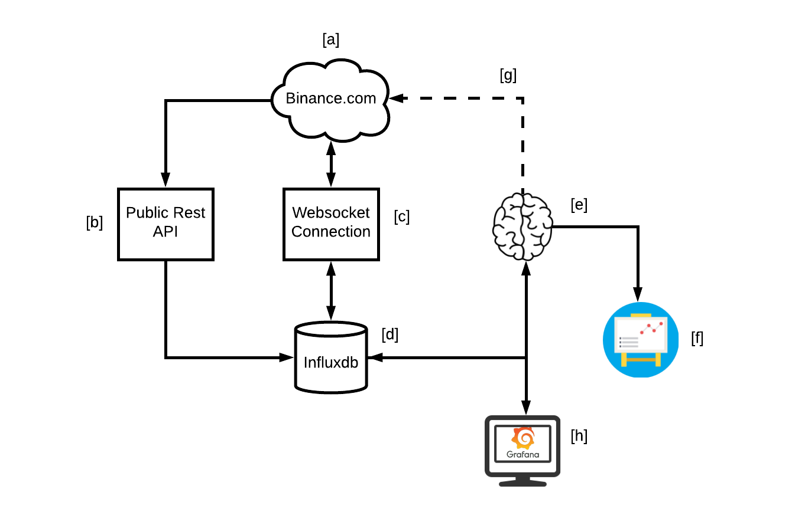

# Idea's diagram:

a) Binance exchanger.
b) The first time we populate the database using Binance's rest API. We do this in this way because, ideally, we just need to update once (the first time).
c) We continuously update the database using binance's websocket connection to stay up to date with the new data.
d) We use Influxdb as our database because its purpose is to handle time series. 
e) The "Brain" of our setup will use tensorflow and python as the main tools.
f) Using the data stored in Influxdb we test several algorithms. 
g) If we found a good algorithm we can connect back to influxdb to buy and sell according to this algorithm.    

