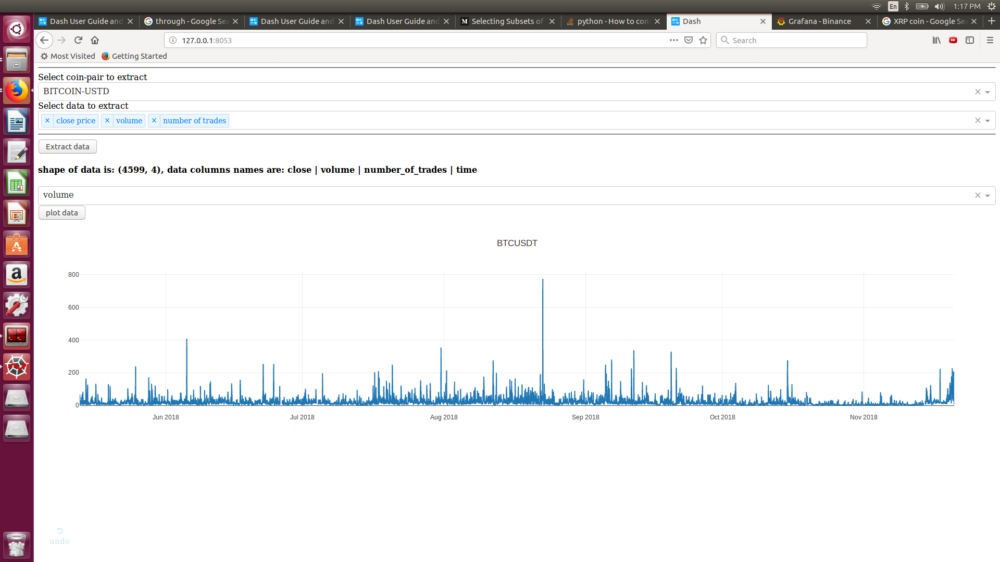

## Under construction
### currently cleaning, sorting, fixing, and uploading what I have in my local computer.
## Idea's diagram:

 - **a:** Binance exchanger.
 - **b:** The first time we populate the database using Binance's rest API. We do this in this way because, ideally, we just need to update once (the first time).
 - **c:** We continuously update the database using binance's websocket connection to stay up to date with the new data.
 - **d:** We use Influxdb as our database because its purpose is to handle time series. 
 - **e:** The "Brain" of our setup will use tensorflow and python as the main tools.
 - **f:** Using the data stored in Influxdb we test several algorithms. 
 - **g:** If we found a good algorithm we can connect back to influxdb to buy and sell according to this algorithm.
 - **h:** We can visualize influxdb data using grafana.

### TODO LIST

- [x] Binance-influxdb connection
- [ ] Calculate and update all Binance indicators
	- We are going to start with 3 following the following youtube video suggestion: https://www.youtube.com/watch?v=fsNQr3poE3g&feature=youtu.be
	- MACD, RSI Stochastics and CCI 
        - MACD:
		- slow: 30 / fast: 15 / MACD length: 9 /average type: exponential
	- CCI
		- length 31
	- RSI
		- 14 30 70
- [ ] Upload files related to the machine learning tests on binance data
- [ ] Upload files related to data extraction and formating from influxdb
- [ ] Make a GUI

### Grafana

The following picture is what you may see once you establish the connection.

The following picture is the Influxdb data extraction interface.

### Steps

 - run Influxdb and Grafana -> go to docker folder where the docker-compose.yml file is and type: docker-compose up -d
 - install python-binance: pip install python-binance
 - install python-influxdb: pip install influxdb
 - install zulu: pip install zulu
