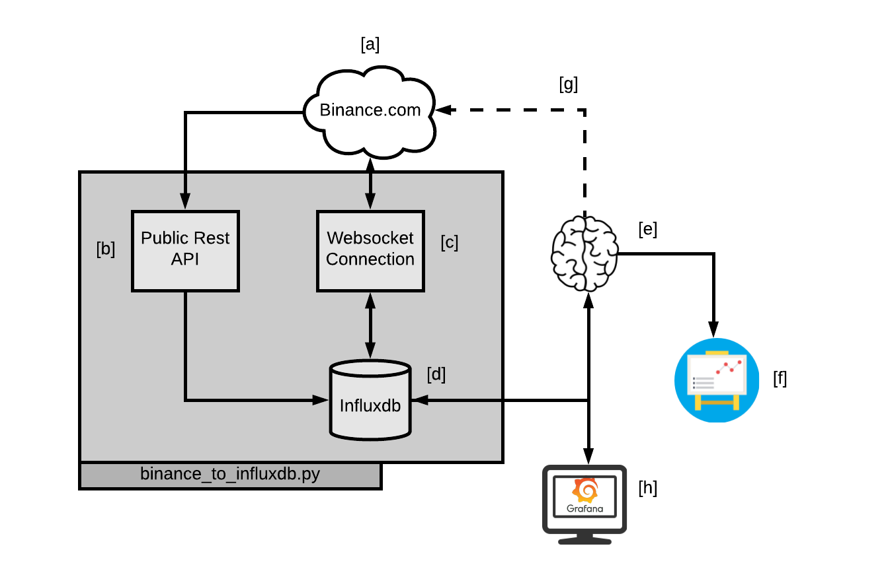

# Here we find the code

### binance_to_influxdb.py

This file is in charge of the following section:

This file contains the class BinanceInfluxdb.

### class BinanceInfluxdb

This class manages the connection between binance and influxdb.
To properly use this class you need to install the following:

 - [binance-python](https://github.com/sammchardy/python-binance)
 - [influxdb-python](https://github.com/influxdata/influxdb-python)

**BinanceInfluxdb class description**

  **Method**                                  | **Purpose**
  ----------------------------------------| --------------------------
  online_process_message                  | This method is executed each time we receive a msg from the websocket connection. It fills the gap between the actual time and the last data point stored in influxdb. If the gap is too big (more than 1 week in minutes) is better to use "insert_offline_tick_data".
  get_previous_point                      | Fill the gap between the actual data being received and the last data stored on influxdb. 
  insert_data_point_influxdb              | Insert a datapoint into influxdb.  
  create_msg_from_history                 | Fetches data from binance and changes the format to match the websocket msg format.
  insert_offline_data                     | Insert a list of points into influxdb.
  insert_offline_tick_data                | Fetches data from binance given a time interval 
  websocket_start                         | Establishes a websocket connection to binance that will keep the infludb data updated.
  websocket_close                         | Closes the websocket connection.  

